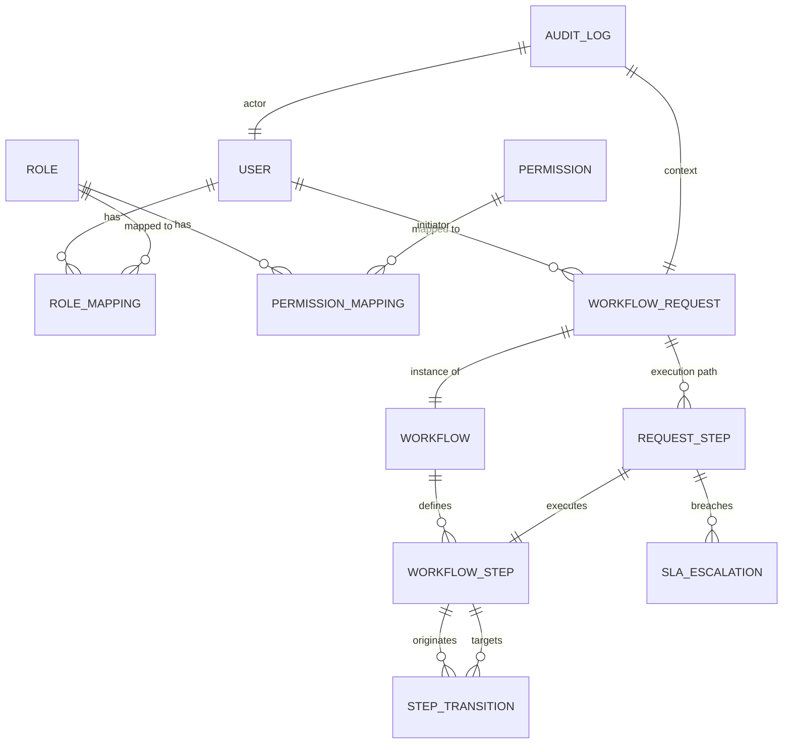

# 📊 NexusFlow: Database Schema & Entity Relationships

The schema is designed for high relational integrity and strict normalization to support generic workflow orchestration.

## 🗝️ Core Models

### 1. Identity Matrix (`User`, `Role`, `Permission`)
- **Users**: Central identity store.
- **Roles**: High-level clearance (Admin, Manager, User).
- **Permissions**: Granular action rights (e.g., `CREATE_WORKFLOW`, `APPROVE_REQUEST`).

### 2. Logic Definitions (`Workflow`, `WorkflowStep`, `StepTransition`)
- **Workflow**: The parent Blueprint.
- **WorkflowStep**: Individual nodes in the logic grid. Stores RBAC requirements (`required_role_id`).
- **StepTransition**: The "Edges" in the graph. Maps `from_step + outcome -> to_step`.

### 3. Operational State (`WorkflowRequest`, `RequestStep`)
- **WorkflowRequest**: A "Living" instance of a workflow. Tracks header-level status (`IN_PROGRESS`).
- **RequestStep**: The atomic execution of a node. Stores `started_at`, `completed_at`, `deadline`, and `outcome`.

### 4. Compliance & Support (`AuditLog`, `SLAEscalation`)
- **AuditLog**: Immutable event stream.
- **SLAEscalation**: Records of missed deadlines and system responses.

---

## 🛡️ Data Integrity Rules
- **Foreign Key Constraints**: All relationships are enforced at the database level.
- **Cascading Policy**: Workflows cannot be deleted if active requests exist.
- **Indexes**: Optimized for rapid lookup of `pending` tasks and `audit` history.
